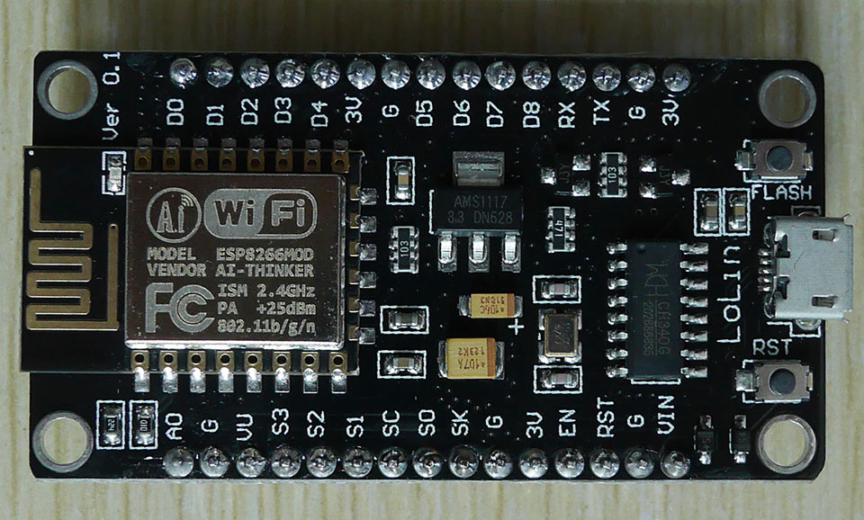

# nodemcu-playground
---



This is my esp8266 nodemcu playground for learning, scripting, and testing.

## Dependencies

1. ch340 driver

Download at https://sparks.gogo.co.nz/ch340.html.

For macOS, you can install './driver/ch34xInstaller.pkg' directly.

2. esptool.py
   
```bash
$ pip install esptool
```

## Reflashing firmware

```bash
./reflash_nodemcu.sh
```
